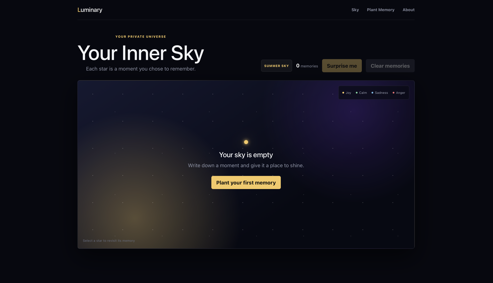
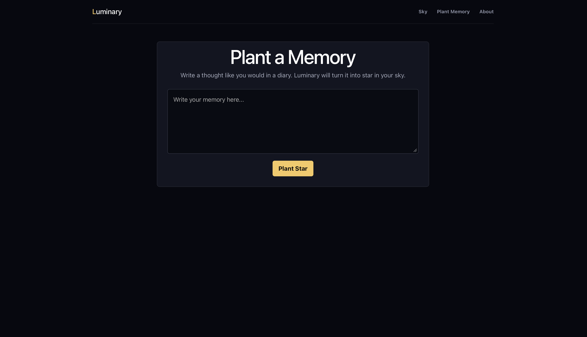
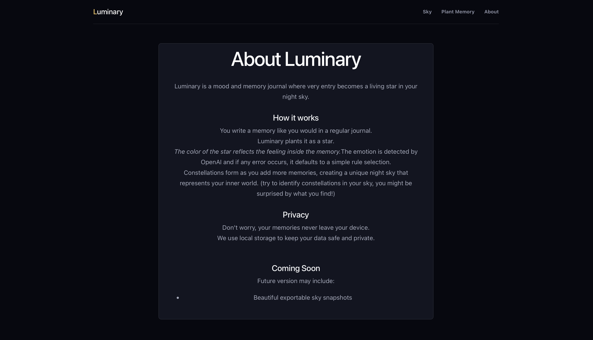

# Luminary

Luminary is like a journal that makes you want to keep writing. Basically, every time you log a memory, it plants a star in your personal sky. You can view the stars and revist memories and I hope that you will definitely love this app.
I personally think this is one of the best projects I have made, and it is a little inspired from the 'Journal' app on ios, 
but even coolor.

## Features

- 3 pages in the app (Will go deep on this in the neext section).
    - ### Sky
        This is the main page of the app, that shows all the stars you have planted with a suprise me and clear all button.
    - ### Plant Memory
        This is the simplest page, this will allow you to `write` your memory and it will be saved as a star. 
    - ### About
        This page helps user by saying `About Luminary` adn how it works and upcoming features.

- **Seaonal Skies** - Really cool feature, this pays attention to the season and changes the sky accordingly. 

- **Emotion Color** - There colors determine if your memory is happy, sad, angry or neutral. This will be predicted, if wrong, isn't the most perfect. Will soon also add making sure you can change the color of the star if you want to. 

- **Memory Sky**- THe sky with stars, the no.of stars will be the no. of memories you have planted. The more you plant, the more beautiful your sky gets.

- **Click a star** - Cicking a star will show the memory you saved.

- **Suprise Me** - Picks a random memory and shows a card.

- **Constellation** - Stars with same emeotion get connected wih a line. Everyone will get a different constellation as the starss get placed randomly in the sky.

- **Storage** - Memories will be saved even after refresh, as the memory is saved in `localStorage`. So it is fast and private, but if you want to export your memories, I am working on it, it will be available in the next update.

## Sky-Page 🎆

This is the first page of the app. It looks like the below :-

- This ⬆ is the start page. It has the navigation bar (2 more pages) at the top left.
- Next, it shows what `type of sky`, `count of memories`, `suprise me` button and `clear memories` button(with confirmation).
- Finally, the sky with stars(yellow, green, blue or red).
- Personally, this is my fav page. It keeps getting better with the seasonal skies, constellation and stars filling up. HOPE YOU LOVE IT TOO.z

## Plant Memory Page 🪏

A simple page, write all the memory and press the button to make it appear in the sky-page. It is very simple to use this.

## About-Page

This says how to use the app. Same as the about page of any app.

## *Try-it-out*

Link: [Luminary](https://luminary-your-inner-life-as-a-night.vercel.app/)

## AI Usage

I used AI as a coding assistant during this project. AI helped me improve the css(part of it) and UI design, simplify styling, debug react problems, and plan some features. I can assure you that the AI usage is less than 30%.

Thanks for reading! Now go and plant some stars in your sky! 🌟
